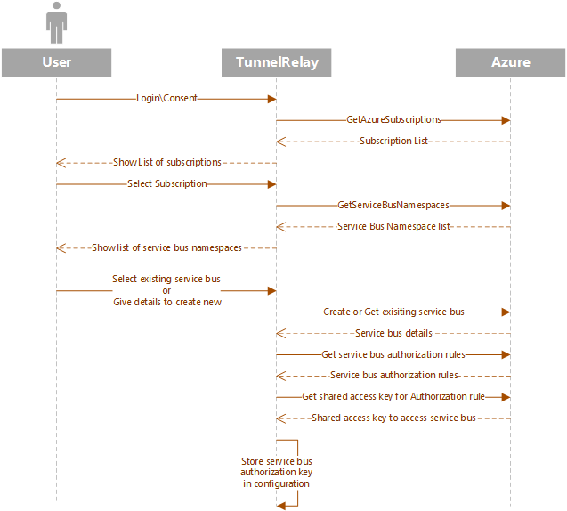

# Tunnel Relay Configuration

As a part of configuration we configure the Service bus which will be used to open relay between Azure and local server. This requires user to login with their Azure credentials and select or create the Service bus namespace they want to use with Tunnel Relay. We __do not__ store Azure credentials. Configuration is stored in appSettings.json file in the Tunnel Relay folder. 

Once a user has logged in and selected Service bus, appSettings.json file can be used on other machines too to skip the login process. To skip login just copy the full Tunnel Relay folder along with the appSettings.Json file to a different machine.

### What is stored?
As a part of configuration we store shared access key for the selected Service bus. Refer [this](https://docs.microsoft.com/en-us/azure/service-bus-messaging/service-bus-authentication-and-authorization) document for more information. This key allows access to selected Service bus and no other resource in the Azure subscription.

Along with Service bus shared access key. We store the redirection url. Redirection url refers to the url to which all incoming requests are routed to. This is usually a local server url in the format of http(s)://localhost:portnumber. Default is http://localhost:3979. This can be changed from the main UI post login at any point.

Plugin data is also stored as a part of configuration along with the list of enabled plugins. This ensures that users don't have to enable or configure plugins every time they start the application. You can read about plugins more [here](PluginManagement.md).

### How do I change selected service bus?
Signing out of Tunnel Relay will remove the service bus information. You can restart the application to login again and select a service bus.

## Configuration process explained

### Diagram

### Details

1. Process begins with user clicking on __'Login with Azure'__ button to launch Azure login prompt. This allows the application to access user's Azure resources on its behalf. We utilize [ADAL](https://github.com/AzureAD/azure-activedirectory-library-for-dotnet) and [Azure Management Libraries](https://github.com/Azure/azure-sdk-for-net/tree/Fluent) to get list of user resources.
2. Once the user has selected the subscription, user is presented with an option to either select an existing [Service Bus](https://azure.microsoft.com/en-us/services/service-bus/) namespace or create a new one. *Note that right now create a new service bus option will always create one with WestUS as location and SKU set to Basic.*
3. Based on user selection in option 2, service bus is either created or fetched.
4. As a last step, we get the shared access key for the service bus with permission set to Send, Listen, Manage. This key is permanently stored in the config (appSettings.json) for future use. All other tokens are discarded and application at no point in the future will access any Azure resource except the selected service bus.
5. Once the configuration is completed, application main window is launched. Traffic can now be routed to your application from the internet using the url shown on the application.
