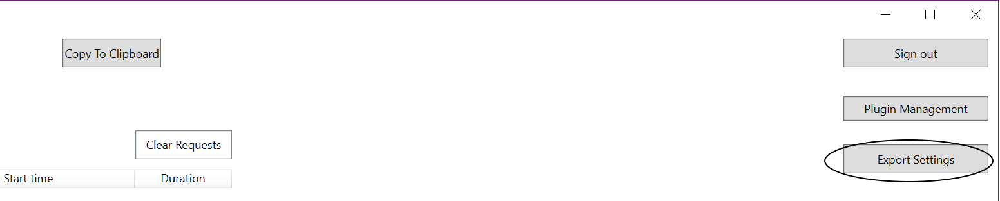
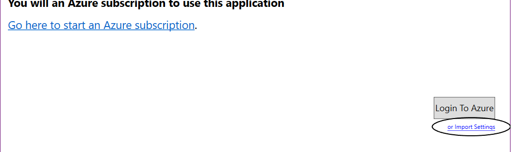

# Advanced Usage for Tunnel Relay

## Exporting and Importing settings
Default configuration for Tunnel Relay requires everyone has access to the service bus or every users needs to create a new one. This can be undesirable at times when you want to use one single service bus, while limiting access to the service bus. Tunnel Relay allows you to use same service bus without the need to login into Azure and gaining access to it. This can be done by exporting Tunnel Relay settings once you have logged in and selected a service bus. This file can then be used on other machines without the need to login into Azure. The process is described below :-

1. Login into Tunnel Relay on one machine with your Azure Credentials and select the service bus you want to share.
2. Let Tunnel Relay establish connection to the Azure Service Bus Relay service.
3. Click on the __Export Settings__ button as shown below

4. Follow the dialog to save the exported settings in a file.
5. Transfer this file to the target machine.
6. Start Tunnel Relay and Startup Screen will appear. Click on __Import Settings__ option at the bottom of the page as shown below.

7. Tunnel Relay will establish connection to the Service Bus.

**NOTE:** Exported settings have Service bus shared access key in plain text so make sure to discard the file once you are done using it.