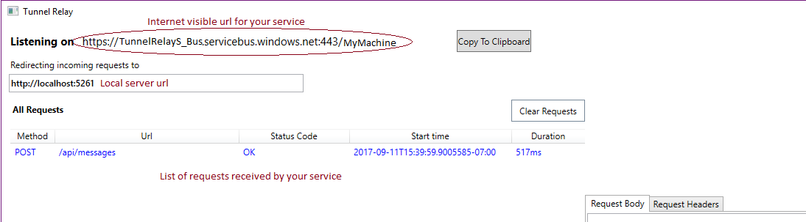

# Tunnel Relay

Tunnel relay allows you to expose local services to the outside world over HTTPS using [Azure Service Bus Relay](https://docs.microsoft.com/en-us/azure/service-bus-relay/relay-wcf-dotnet-get-started).

## Why Tunnel Relay?
Easiest way to test services during development phase is to host them on local development machines and then call them from external services. Though itself is a different ordeal especially because most developers don't have a static IP which is visible to the external world. Possible way to get away from this is to either have a personal deployment in a public cloud like [Microsoft Azure](https://azure.microsoft.com/en-us/) or use external tools which give you a public endpoint which can then be used to route data to your local development machine.

Although these tools suffer from their own issues from being costly to not have a static url, which means every time to restart the tool it ends up giving you a new public url. We found that there was no solution which was both easy to use and allow pay-as-you-use model, so we built one.

## Motivation
Microsoft recently introduced [Microsoft Bot Framework](https://dev.botframework.com) which allows developers to build bots which can be used on platforms like [Microsoft Teams](https://products.office.com/en-US/microsoft-teams/group-chat-software), [Skype](https://www.skype.com/en/) and a lot more. Registration on Bot framework portal requires you to provide a public url to which all the messages to bot will be sent. This meant that during development and debugging of the bot, developers need to either deploy to a public deployment or have a tunnel open to their machine and give this tunnel's url to Bot framework website. While looking for a solution for developers we considered the following requirements :-

1. A set url which does not change frequently
2. Should allow HTTPS traffic
3. Should not be bound by a monthly subscription
4. Should not require complex configuration
5. Should not require code change on Bot side to work

We found that Microsoft Azure already has an offering built for such purpose specifically for services called [Azure Service Bus Relay](https://docs.microsoft.com/en-us/azure/service-bus-relay/relay-wcf-dotnet-get-started). Service bus relay allows services behind NAT to be exposed to the outside world. But integrating Service bus relay requires code change to Bot. Hence we started building a tool which would abstract out the required bits to get Service bus relay working into a separate tool and then host this as an independent utility.

## What do I need?
We wanted to build a solution which was easy to use and works out of the box. Here are the things you need to run Tunnel Relay.

1. Windows with .Net Framework 4.6.1
2. Microsoft Azure subscription (you can sign up for a free trial [here](https://azure.microsoft.com/en-us/free/))

and that is it.

## Get Started
Following image explains the basic components of the app. User needs to login before they can start using the app. This is covered in [Configuration](Configuration.md).

## Understand how Tunnel Relay works
Please refer to following options to learn more about Tunnel Relay and it's internal workings

1. [Configuration](Configuration.md)
2. [Request Handling](RequestHandling.md) 
3. [Internal Design](InternalDesign.md)
4. [Extending Tunnel Relay - Plugins](PluginManagement.md)

## FAQs

Q. Do my clients need to change to understand that they are contacting server over Tunnel Relay vs directly?  
A. Short answer no. All your clients need to see is the url exposed by Tunnel Relay. Rest everything remains the same.

Q. Can I share same Service bus namespace across multiple machines?  
A. Yes, you can share same service bus namespace across multiple machines. Each relay is a unique combination of service bus and machine name.

Q. How much will this cost me?  
A. Tunnel Relay itself is a free, open-source tool, although since it is backed by Azure Service Bus, you will have to pay for the Service Bus itself. Pricing for service bus can be found [here](https://azure.microsoft.com/en-us/pricing/details/service-bus/). Tunnel Relay creates a service bus with __basic tier__. Please look for section WCF Relays to get the pricing information.

Q. I have an issue which needs your attention how can I contact you?  
A. We monitor this Github repo for issues. Please open a new issue, or reply to an existing one. We will get back to you soon. 

Q. I want to extend Tunnel Relay. How can I do so?  
A. Tunnel Relay is released under [MIT License](https://opensource.org/licenses/MIT). Please look at the contributing section below if you want to contribute to this project.

### Contributing

This project has adopted the [Microsoft Open Source Code of Conduct](https://opensource.microsoft.com/codeofconduct/). For more information see the [Code of Conduct FAQ](https://opensource.microsoft.com/codeofconduct/faq/) or contact [opencode@microsoft.com](mailto:opencode@microsoft.com) with any additional questions or comments.

