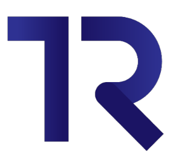
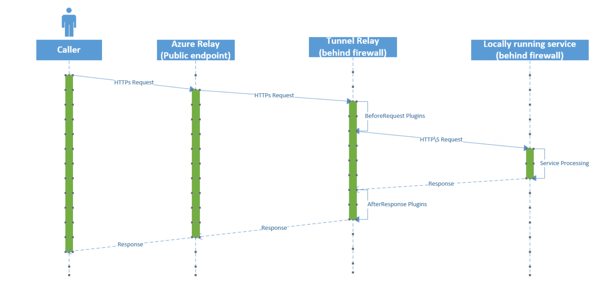

# Tunnel Relay

Tunnel relay allows you to expose local services to the outside world over HTTPS using [Azure Relay](https://docs.microsoft.com/en-us/azure/service-bus-relay/relay-what-is-it#hybrid-connections).

## Overview
Since most developers don't have static IP addresses for their development machines visible to the external world, it is incredibly cumbersome for them to develop and test services. Tunnel Relay is a free and open-source tool that provides you a static URL for your local service which can be accessed externally!

## Download
Latest release can be downloaded [here](https://github.com/OfficeDev/microsoft-teams-tunnelrelay/releases/latest).
 
You can also access the latest nuget packages for extending Tunnel Relay at https://www.myget.org/F/tunnelrelay/api/v3/index.json

## Requirements

### Supported Operation Systems
Tunnel Relay is written on top of [.Net Core 3.1](https://devblogs.microsoft.com/dotnet/announcing-net-core-3-1/). Thus the minimum OS requirements are same as .Net Core 3.1. You can check these requirements [here](https://github.com/dotnet/core/blob/master/release-notes/3.1/3.1-supported-os.md)

### Microsoft Azure

Tunnel Relay uses [Azure Relays](https://docs.microsoft.com/en-us/azure/service-bus-relay/relay-what-is-it) so you need a Microsoft Azure Subscription. You can sign up for a free trial [here](https://azure.microsoft.com/en-us/free/)

## Get Started

Tunnel Relay supports 2 variants. GUI and CUI based. GUI is only supported in Windows, while CUI is supported in all 3 supported OSes (Windows, Linux and OSX).

Both of these will guide the user through the setup process. All settings are stored in appSettings.json in the executable directory. You can delete this file at anytime to reset and start over.

Following image explains the basic components of the app when GUI mode is being used. User needs to login before they can start using the app. This is covered in [Configuration](Documentation/Configuration.md).

## FAQs
**Q.** How is Tunnel Relay v2 different from Tunnel Relay v1?  
**A.** Tunnel Relay v2 adds support for Linux and Mac Operation systems. To achieve this, it uses [Hybrid Connections](https://docs.microsoft.com/en-us/azure/service-bus-relay/relay-what-is-it#hybrid-connections).
This also means that the Relays of v1 cannot be reused in v2. Additionally v2 adds support for commandline.

**Q.** Do my clients need to change to understand that they are contacting server over Tunnel Relay vs directly?  
**A.** Short answer no. All your clients need to see is the url exposed by Tunnel Relay. Rest everything remains the same.

**Q.** Can I share same Relay namespace across multiple machines?  
**A.** Yes, you can share same Azure Relay namespace across multiple machines. Each relay is a unique combination of Azure Relay and machine name.

**Q.** How much will this cost me?  
**A.** Tunnel Relay itself is a free, open-source tool, you will have to pay for the Azure Relay itself. Pricing for Azure Relay can be found [here](https://azure.microsoft.com/en-us/pricing/details/service-bus/). Please look for section *Hybrid connections and Windows Communication Foundation (WCF) relays* to get the pricing information.

**Q.** I have an issue which needs your attention how can I contact you?  
**A.** We monitor this Github repo for issues. Please open a new issue or reply to an existing one. We will get back to you soon. 

**Q.** I want to extend Tunnel Relay. How can I do so?  
**A.** Tunnel Relay is released under [MIT License](https://opensource.org/licenses/MIT). Please look at the contributing section below if you want to contribute to this project.

## Understand how Tunnel Relay works
Please refer to following articles to learn more about Tunnel Relay and its internal workings

1. [Configuration](Documentation/Configuration.md)
2. [Request Handling](Documentation/RequestHandling.md) 
3. [Internal Design](Documentation/InternalDesign.md)
4. [Extending Tunnel Relay - Plugins](Documentation/PluginManagement.md)
5. [Advanced Functionality](Documentation/AdvancedTopics.md)

## Issues, problems, feedback, questions?
Please report them [here](https://github.com/OfficeDev/microsoft-teams-tunnelrelay/issues)

## Contributing

This project has adopted the [Microsoft Open Source Code of Conduct](https://opensource.microsoft.com/codeofconduct/). For more information see the [Code of Conduct FAQ](https://opensource.microsoft.com/codeofconduct/faq/) or contact [opencode@microsoft.com](mailto:opencode@microsoft.com) with any additional questions or comments.
